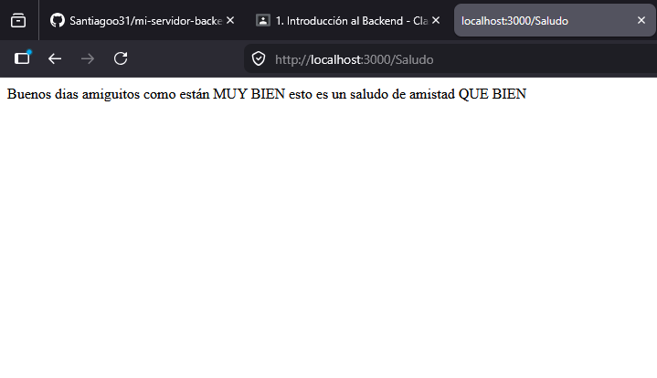
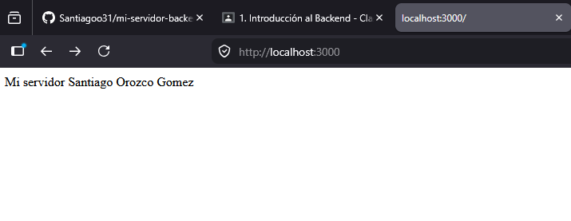
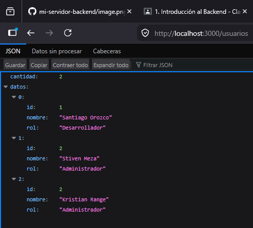

# Proyecto Backend Mi Primer Servidor con Express

Este proyecto es el resultado de mi fase de contextualización en desarrollo backend. El objetivo fue construir un servidor desde cero para entender cómo funciona la comunicación entre un cliente y un servidor.

## ¿Qué aprendí?
- **Entorno de ejecución:** Aprendí a usar Node.js para ejecutar JavaScript fuera del navegador.
- **Gestión de dependencias:** Entendí cómo `package.json` y `npm` permiten administrar librerías externas como Express.
- **Ciclo Petición-Respuesta:** Comprendí que el backend se basa en recibir una petición (`req`), procesarla y enviar una respuesta (`res`).
- **Rutas (Endpoints):** Aprendí a estructurar una aplicación mediante diferentes rutas (`/`, `/saludo`, `/usuarios`).

## Explicación del Código (index.js)

El código sigue una lógica lineal simple:

1. **`const express = require('express');`**: Importamos la librería Express para facilitar la creación del servidor.
2. **`const app = express();`**: Inicializamos la aplicación.
3. **Definición de rutas (`app.get`):** - Define qué sucede cuando el cliente accede a una URL específica.
   - Usamos `res.send()` para enviar texto o `res.json()` para enviar datos estructurados.
4. **`app.listen(port, ...)`**: Es el comando final que mantiene el servidor "encendido" y escuchando las solicitudes en el puerto 3000.

### Diferencia clave entre funciones
- **`app.get()`**: Se usa para rutas específicas que responden cuando el usuario entra a una dirección método GET.
- **`app.use()`**: Si se implementa sirve para ejecutar procesos globales o *middlewares* que corren antes de que cualquier ruta procese la petición.

## Instrucciones para ejecutar
1. Clona el repositorio.
2. Instala las dependencias: `npm install`.
3. Inicia el servidor: `node index.js`.
4. Accede a `http://localhost:3000` en el navegador.

## Imagenes de envidencia

**Ruta raíz (/)**
![Respuesta de la ruta raíz]

**Ruta /saludo**
![Respuesta de la ruta saludo] 

**Ruta /usuarios**
![Respuesta de la ruta usuarios] 
